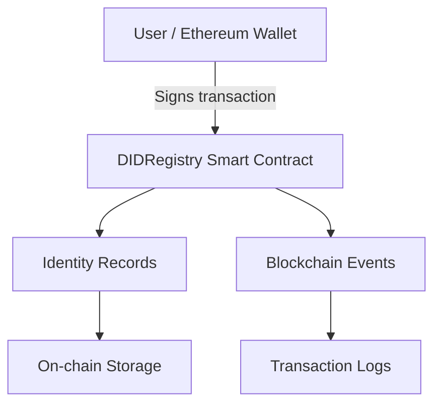

# DID Smart Contract

A decentralized identity registry built with Solidity and Hardhat. This project provides the on-chain foundation for registering and managing decentralized identity records associated with Ethereum wallet addresses.

The smart contract allows users to register an identity hash, update it, and retrieve identity records from the blockchain while enforcing basic ownership and access-control rules.

**Project scope:** This repository focuses exclusively on the smart contract layer, including Solidity implementation, automated tests, and deployment and verification documentation. The backend and frontend are maintained as separate projects.

## Table of Contents

- [Overview](#overview)
- [Project Scope](#project-scope)
- [Architecture](#architecture)
- [Features](#features)
- [Smart Contract Interface](#smart-contract-interface)
- [Data Model](#data-model)
- [Events](#events)
- [Security Considerations](#security-considerations)
- [Technology Stack](#technology-stack)
- [Getting Started](#getting-started)
- [Running Tests](#running-tests)
- [Usage Example](#usage-example)
- [Deployment](#deployment)
- [Limitations](#limitations)
- [Roadmap](#roadmap)
- [Related Repositories](#related-repositories)
- [License](#license)

## Overview

Decentralized identity (DID) systems aim to give individuals greater control over their digital identities without relying exclusively on centralized identity providers.

This project explores the smart contract layer of a decentralized identity system by implementing an on-chain registry that associates an Ethereum wallet address with an identity hash.

The registry provides basic identity registration, updates, ownership enforcement, and event emission. It is intended as a foundation for further development of a broader decentralized identity application.

### Objectives

- Implement a decentralized identity registry using Solidity.
- Associate wallet addresses with identity hashes.
- Enforce ownership rules for identity registration and updates.
- Provide functions for retrieving identity records.
- Emit blockchain events for registration and update operations.
- Establish an automated testing foundation for contract behavior and access control.

## Project Scope

This repository contains the **smart contract layer only**.

### Included

- Solidity smart contract implementation.
- Hardhat development environment.
- Automated contract tests.
- Registration and update logic.
- Ownership and access-control checks.
- Identity record retrieval.
- Event emission.
- Smart contract deployment and verification documentation.

### Not included

The following components belong to separate repositories or future development phases:

- Backend API and server-side application logic.
- Frontend user interface.
- Wallet connection interface.
- Authentication and signed-challenge verification.
- Verifiable Credentials (VCs).
- Decentralized identity document resolution.
- Identity recovery and key rotation workflows.
- Advanced privacy-preserving identity verification.

Keeping these responsibilities separate makes the smart contract independently testable and easier to integrate with other applications.

## Architecture

The current architecture focuses on the interaction between an Ethereum-compatible wallet, an application, and the DID registry smart contract.



### Architecture components

**1. User / Ethereum Wallet**

A user interacts with the contract through a compatible wallet or an application capable of submitting blockchain transactions.

The wallet signs transactions that register or update the user's identity hash.

**2. DIDRegistry Smart Contract**

The contract implements the core registry logic, including registration, updates, ownership checks, record retrieval, and event emission.

**3. Identity Records**

The contract stores an identity record associated with each wallet address.

**4. Blockchain Events**

The contract emits events when an identity is registered or updated, allowing external systems to monitor relevant blockchain activity.

> The backend, frontend, and external identity services are outside the scope of this repository.

## Features

### Identity Registration

Users can register an identity hash associated with their wallet address.

The contract prevents duplicate registration for the same wallet and rejects an empty identity hash.

### Identity Updates

The owner of a registered identity can update its identity hash.

An address that does not own the identity cannot update another user's record.

### Identity Retrieval

The contract provides functions to retrieve an identity record and check whether an address has registered an identity.

### Event Emission

Registration and update operations emit events that can be monitored by blockchain applications and event listeners.

### Access Control

Identity updates are restricted to the wallet address that owns the corresponding record.

## Smart Contract Interface

The main contract is `DIDRegistry`.

| Function | Description |
|---|---|
| `registerDID(bytes32 identityHash)` | Registers a new identity hash for the caller. |
| `updateDID(bytes32 identityHash)` | Updates the caller's existing identity hash. |
| `getDID(address user)` | Retrieves the identity record associated with an address. |
| `hasDID(address user)` | Checks whether an address has registered an identity. |

### Registration

The `registerDID` function:

- Rejects an empty identity hash.
- Prevents duplicate registration by the same address.
- Associates the identity record with the caller's address.
- Records the creation and update timestamps.
- Emits a `DIDRegistered` event.

### Update

The `updateDID` function:

- Requires an existing identity record.
- Allows only the record owner to update the identity hash.
- Rejects an empty identity hash.
- Updates the record's modification timestamp.
- Emits a `DIDUpdated` event.

### Retrieval

The `getDID` function retrieves a record by wallet address.

The `hasDID` function returns whether an address has a registered identity.

## Data Model

Each identity record contains the following fields:

```solidity
struct DID {
    address owner;
    bytes32 identityHash;
    uint256 createdAt;
    uint256 updatedAt;
}
```

The records are stored in a mapping indexed by wallet address:

```solidity
mapping(address => DID) private dids;
```

### Field descriptions

| Field | Type | Description |
|---|---|---|
| `owner` | `address` | Wallet address associated with the identity record. |
| `identityHash` | `bytes32` | Hash representing the identity data. |
| `createdAt` | `uint256` | Timestamp when the record was created. |
| `updatedAt` | `uint256` | Timestamp of the most recent update. |

The mapping is private, while the contract's public retrieval functions expose the relevant records.

### Identity Hash

The contract stores an identity hash rather than a complete identity document.

For example, an application can calculate a hash off-chain and submit the resulting `bytes32` value to the contract.

```typescript
const identityHash = ethers.keccak256(
  ethers.toUtf8Bytes("example-identity")
);
```

This is a demonstration of hash generation, not a recommended production identity-data format.

**Privacy note:** Hashing does not automatically make personal information private. Predictable or low-entropy data can potentially be guessed and hashed again. Do not submit raw personal information or unsalted hashes of predictable personal information to the blockchain.

A production system should carefully define its identity commitment format, privacy requirements, and data-handling model.

## Events

The contract emits events to make identity operations observable on the blockchain.

### DIDRegistered

Emitted when a new identity record is registered.

### DIDUpdated

Emitted when an existing identity record is updated.

Events can be consumed by external applications, indexers, or monitoring services. Those integrations are not implemented in this repository.

Refer to the Solidity contract for the exact event parameters and types.

## Security Considerations

Security is a core consideration when implementing smart contracts that manage identity-related records.

The current implementation includes basic protections.

### Implemented protections

- Prevents duplicate registration for the same wallet address.
- Restricts identity updates to the record owner.
- Rejects empty identity hashes.
- Prevents updates to nonexistent identity records.
- Uses wallet addresses as the basis for ownership checks.
- Includes automated tests for core functionality and access-control behavior.

### Important limitations

**Wallet ownership is not proof of legal identity.**

The contract verifies that a transaction is authorized by the wallet associated with a record. It does not independently establish the real-world identity of the wallet owner.

**Identity hashes are not automatically private.**

Hashing sensitive data does not guarantee confidentiality, especially when the original data can be guessed.

**Blockchain records are persistent.**

Applications should carefully consider what information is stored on-chain because blockchain data may remain publicly accessible.

**Automated tests are not a security audit.**

Passing tests provides evidence that the tested scenarios behave as expected. It does not establish that the contract is free from vulnerabilities.

This project should not be considered production-ready solely because its tests pass. A production deployment would require further threat modeling, security review, and potentially an independent smart contract audit.

## Technology Stack

| Technology | Purpose |
|---|---|
| Solidity | Smart contract development |
| Hardhat | Development, compilation, testing, and deployment tooling |
| TypeScript | Test scripts and development tooling |
| Ethers.js | Ethereum interaction in scripts and tests |
| Chai | Test assertions |
| Mocha | Test execution framework |

## Getting Started

### Prerequisites

Install the following tools:

- Node.js
- npm
- Git

A compatible Ethereum wallet and testnet funds may also be required for testnet interaction.

### 1. Clone the Repository

Replace the placeholder with the actual repository URL.

```bash
git clone <YOUR_REPOSITORY_URL>
cd did-smart-contract
```

### 2. Install Dependencies

```bash
npm install
```

### 3. Compile the Smart Contract

```bash
npx hardhat compile
```

### 4. Run the Tests

```bash
npx hardhat test
```

The test suite covers the contract's core behavior, including registration, updates, retrieval, events, and access-control checks.

## Running Tests

Automated tests are an essential part of validating the contract's behavior.

The current test coverage is organized around the following areas:

| Test category | Purpose |
|---|---|
| Core functionality | Registration, retrieval, updates, and identity existence checks. |
| Events | Verifies registration and update event behavior. |
| Security and access control | Checks duplicate registration, unauthorized updates, nonexistent records, and empty identity hashes. |

Run the complete test suite with:

```bash
npx hardhat test
```

Tests should be rerun after changes to the contract, configuration, or test code.

## Usage Example

The following examples illustrate how an application can interact with a deployed contract using Ethers.js.

They assume that `didRegistry` is an initialized contract instance and `ethers` is available.

### Register an Identity

Generate an example hash and register it from the connected wallet:

```typescript
const identityHash = ethers.keccak256(
  ethers.toUtf8Bytes("example-identity")
);

const tx = await didRegistry.registerDID(identityHash);
await tx.wait();
```

The transaction is submitted by the connected signer. The caller's wallet address becomes the owner of the registered record.

### Check Whether an Identity Exists

```typescript
const walletAddress = await signer.getAddress();

const exists = await didRegistry.hasDID(walletAddress);

console.log("Identity registered:", exists);
```

### Retrieve an Identity

```typescript
const did = await didRegistry.getDID(walletAddress);

console.log("Owner:", did.owner);
console.log("Identity hash:", did.identityHash);
console.log("Created at:", did.createdAt.toString());
console.log("Updated at:", did.updatedAt.toString());
```

### Update an Identity

```typescript
const updatedIdentityHash = ethers.keccak256(
  ethers.toUtf8Bytes("updated-example-identity")
);

const tx = await didRegistry.updateDID(updatedIdentityHash);
await tx.wait();
```

The update must be submitted by the wallet that owns the identity record.

These examples are illustrative. They do not include contract deployment, provider configuration, or application-specific error handling.

## Deployment

The contract can be deployed to a compatible Ethereum network using Hardhat.

Before deploying:

1. Configure the target network in the Hardhat configuration.
2. Configure the required RPC endpoint and deployment account securely.
3. Ensure the deployment account has sufficient funds for transaction fees.
4. Compile the contract and run the test suite.
5. Deploy to a testnet before considering any production deployment.
6. Verify the deployed contract on a supported block explorer where applicable.

Keep private keys and API keys out of source control.

Use environment variables or a suitable secrets-management solution for deployment credentials. Do not commit `.env` files containing secrets.

Deployment network names, contract addresses, transaction hashes, and verification links should be added to the documentation only after an actual deployment has been completed.


## Roadmap

Potential future improvements to the smart contract include:

- [ ] Expand unit and edge-case test coverage.
- [ ] Improve deployment scripts and network configuration.
- [ ] Evaluate identity commitment formats and privacy risks.
- [ ] Explore identity deactivation and revocation mechanisms.
- [ ] Design secure key rotation and recovery workflows.
- [ ] Evaluate integration requirements for verifiable credentials.
- [ ] Conduct a security review before production use.

The backend and frontend are separate development efforts and are not part of this repository's implementation scope.

## Related Repositories

The broader decentralized identity application is intended to be organized into independent repositories.

| Repository | Responsibility | Status |
|---|---|---|
| `did-smart-contract` | Solidity contracts, automated tests, deployment, and verification documentation. | Current repository |
| `did-backend` | Backend APIs, blockchain integration, and server-side application logic. | Separate project |
| `did-frontend` | User interface, wallet connection, and identity-management workflows. | Separate project |

Repository links can be added below when the corresponding repositories are available:

- **Backend:** `<BACKEND_REPOSITORY_URL>`
- **Frontend:** `<FRONTEND_REPOSITORY_URL>`

The placeholders above are not actual repository links.

## License

This project is licensed under the MIT License.

---

**Disclaimer:** This project is intended for educational, research, and portfolio purposes. It is not a complete identity solution and should not be used to manage sensitive production identity data without further development and security review.